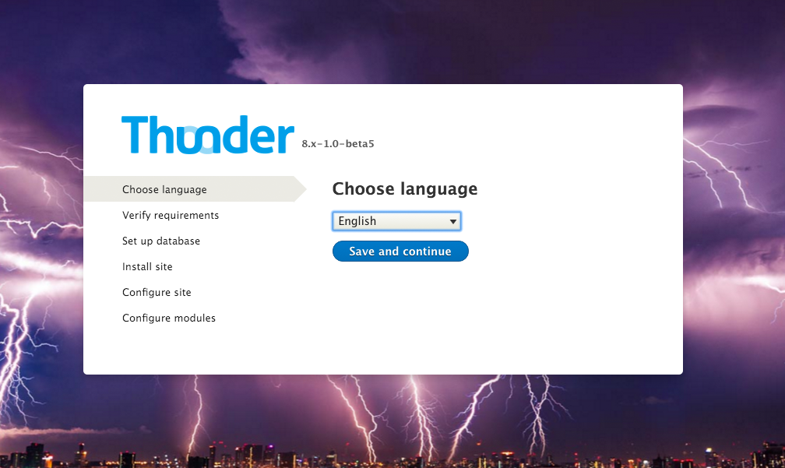
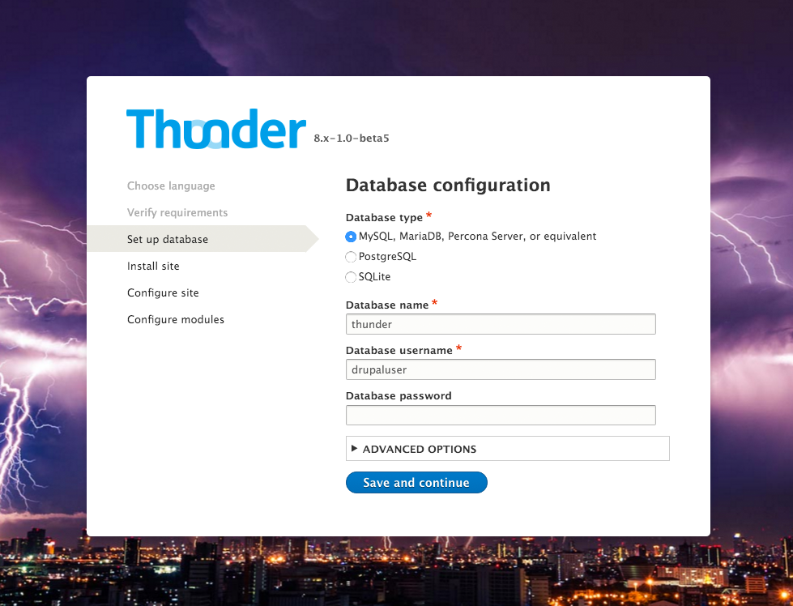
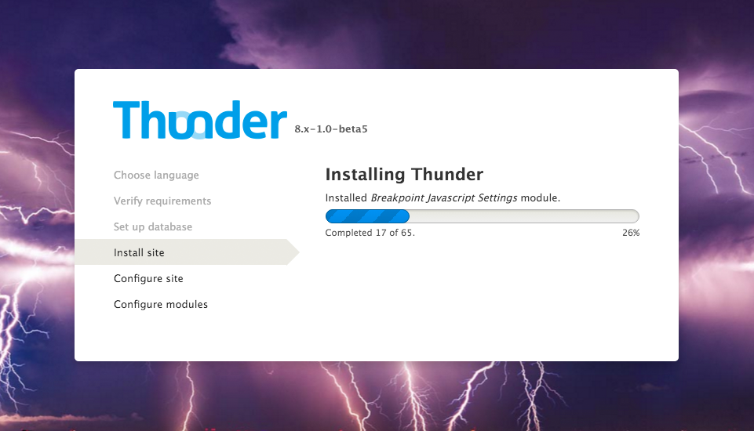
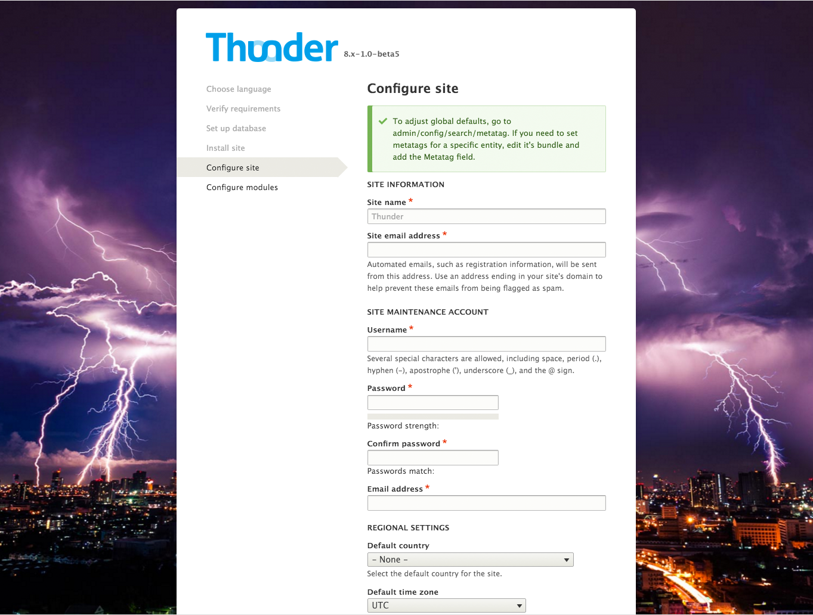
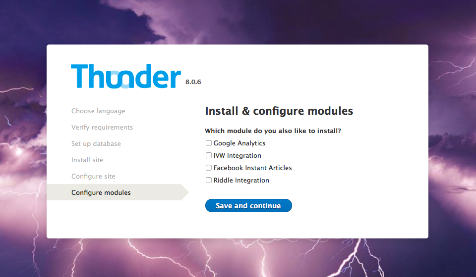
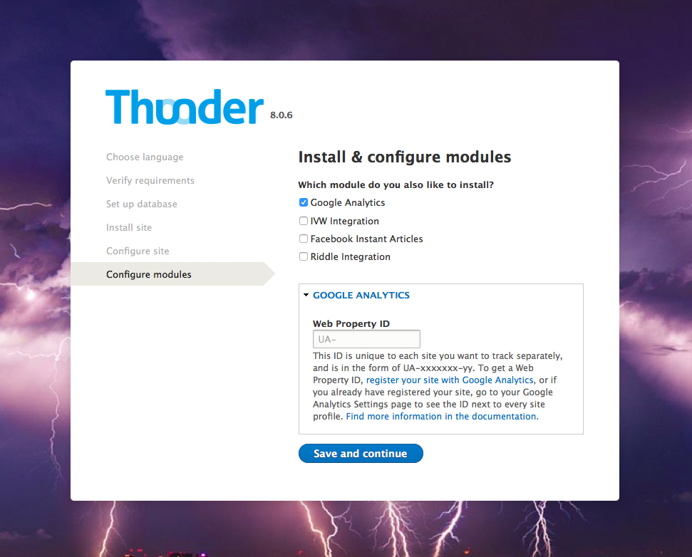
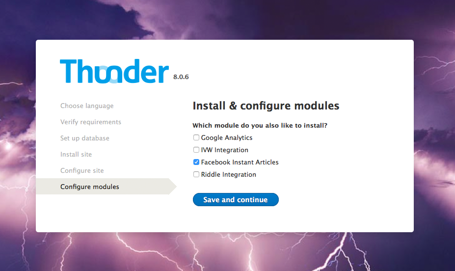
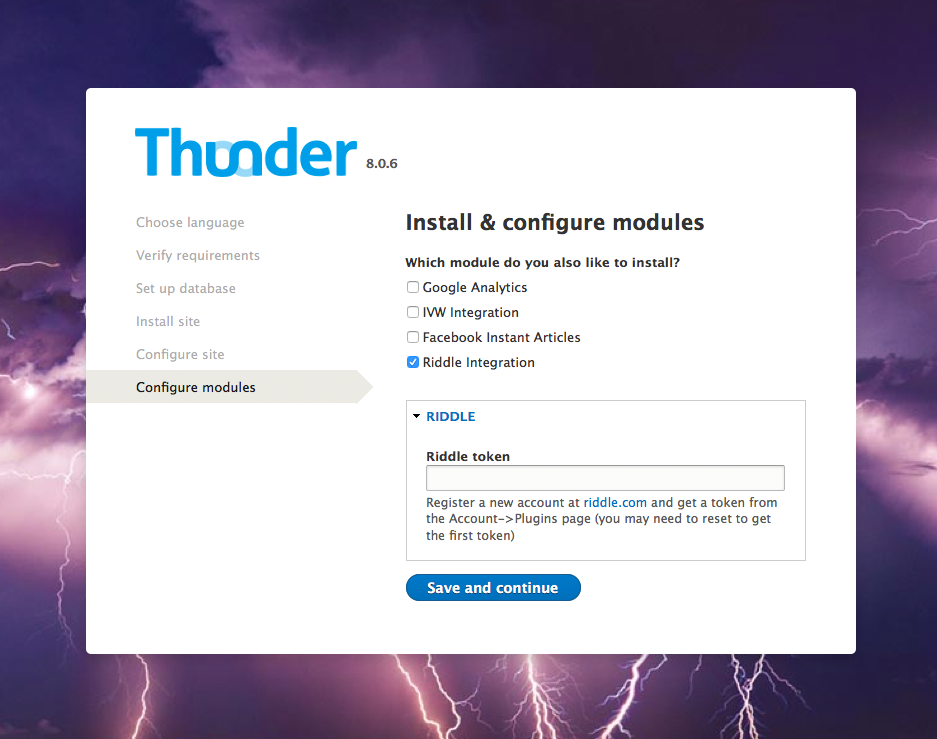

# Installation

We recommend reading the installation documentation of Drupal: [https://www.drupal.org/documentation/install]().  
You can get Thunder by downloading it from [https://www.drupal.org/project/thunder](). We suggest the usage of composer for downloading thunder and managing your additional modules. See [here](https://github.com/BurdaMagazinOrg/thunder-project) for a description howto do that.
Download the newest release and install it into your web server document root. Now open the URL pointing to the document root, where you will be directed through the installation process.

1. Choose language

2. Configure your database

3. Now it’s installing...

4. Configure your site

Define a site name and email-address, set admin username and password and configure your regional settings

5. Install additional modules

 5. Install & configure Google Analytics (optional)
 

 5. Install & configure IVW Integration (optional)

 5. Install Facebook Instant Articles (optional)

 5. Install & configure Riddle integration (optional)

